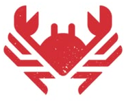

# 🦀 MangueChain

## 📑 Table of Contents

- [📑 Table of Contents](#-table-of-contents)
- [🔗 Important Links](#-important-links)
- [🏗️ Project Architecture](#-project-architecture)
- [🎯 About the Project](#-about-the-project)
- [🌟 Why Use MangueChain?](#-why-use-manguechain)
- [✨ Features](#-features)
- [🧩 Problem](#-problem)
- [🛠️ Technologies Used](#-technologies-used)
- [📍 Roadmap](#-roadmap)

- [🗺️ Usage Flow](#-usage-flow)
- [🌱 Why is MangueChain needed?](#-por-que-o-manguechain-é-necessário)
- [🏅 What Makes MangueChain Revolutionary?](#what-makes-manguechain-revolutionary)

- [🚀 Why is MangueChain the future of environmental solidarity?](#-why-is-manguechain-the-future-of-environmental-solidarity)
- [👥 Team](#-team)

## 🔗 Important Links

- 🚀 [Production Site](#) 
- 📽️ [Pitch Deck](#)
- 🧑‍💻 [Live Demo](#)
- 💬 [Community / Discussions](#)
- ✉️ [Contact](mailto:contato.davimoliveira@gmail.com)

---

## 🏗️ Project Architecture

<!-- Describe the general architecture of the project here, if desired. -->

## 🎯 About the Project

MangueChain transforms donations into impactful actions by combining blockchain transparency with social and environmental engagement. Donors not only contribute financially — they become part of a digital wall of hope, supporting the restoration of Recife's mangroves.

## 🌟 Why Use MangueChain?

- Full transparency: all donations are recorded in auditable smart contracts.
- Recognition: top donors receive exclusive NFTs.
- Interactivity: public wall of messages and visible impact.
- Scalability: modern and upgradable Web3 architecture.

## ✨ Features

- Connect with Ethereum wallet (MetaMask/Web3)
- View solidarity vault balance
- Donate any amount in ETH
- Animated social impact cards
- Modern and responsive layout
- Transparent and auditable donations
- Automatic contract rotation system

## 🧩 Problem

The mangroves of Recife face severe degradation, while waste pickers — essential for environmental preservation — are undervalued. Traditional donation models lack transparency and impact traceability, making it difficult for donors to see real results from their contributions.

## 🛠️ Technologies Used

- **Frontend**: React + TypeScript + Tailwind CSS
- **Smart Contracts**: Solidity + OpenZeppelin
- **Blockchain**: Ethereum
- **Wallet Integration**: MetaMask and Web3 wallets
- **Libraries**: ethers.js, AOS, Framer Motion

## 📍 Roadmap

### Version 1.0 (MVP) - ✅ Completed
- [x] Basic pet registration system

### Version 1.1 🎯 Planned
- [ ] Search and filter system

## 🗺️ Usage Flow

## 🌱 Por que o MangueChain é necessário?

The mangroves of Recife face enormous challenges due to pollution and urban expansion. Access to resources for conservation is limited, and current donation platforms lack transparency, interactivity, and tangible rewards for engaged donors.

## What Makes MangueChain Revolutionary?

### 🔗 On-Chain Transparency
All donations are recorded in auditable and immutable smart contracts, ensuring full traceability and trust.

### 🧱 Public Wall of Hope
Each block on the blockchain carries a positive message, forming an interactive wall of support accessible through the web interface.

### 🏅 Recognition NFTs
The top donor of each cycle receives an exclusive NFT, immortalizing their contribution and encouraging the continuation of the restoration chain.

### 🌐 Scalable Web3 Architecture
Platform built with Solidity contracts and proxies for upgrades, scalability, and maintenance without losing decentralization.

## 🚀 Why is MangueChain the future of environmental solidarity?

MangueChain addresses critical gaps in traditional donation platforms:

- Lack of transparency in fund allocation
- No recognition/reward for donors
- Lack of emotional communication and direct impact
- Zero interactivity between donors and the cause

MangueChain combines blockchain and emotional design to create a decentralized network of solidarity, where everyone can contribute with real impact — and be recognized for it.

**MangueChain is not just a DApp — it's a decentralized social revolution, where every transaction transmits hope and every block is a message of restoration.**

## 👥 Team

| Member                | Role                | Contact                                                                                 |
|-----------------------|---------------------|----------------------------------------------------------------------------------------|
|       | Backend Developer     | [Email](mailto:contato.davimoliveira@gmail.com) / [LinkedIn](https://www.linkedin.com/in/davi-oliveira-36063a357/) |
|       | Frontend Developer    | [Email](mailto:lekinhoj@gmail.com) / [LinkedIn](https://www.linkedin.com/in/%C3%A1lex-joubert-5451b215b/)         |
|   | Tech Leader           | [Email](mailto:Jpemiliano@gmail.com) / [LinkedIn](https://www.linkedin.com/in/jose-emiliano-004a8938/)            |
